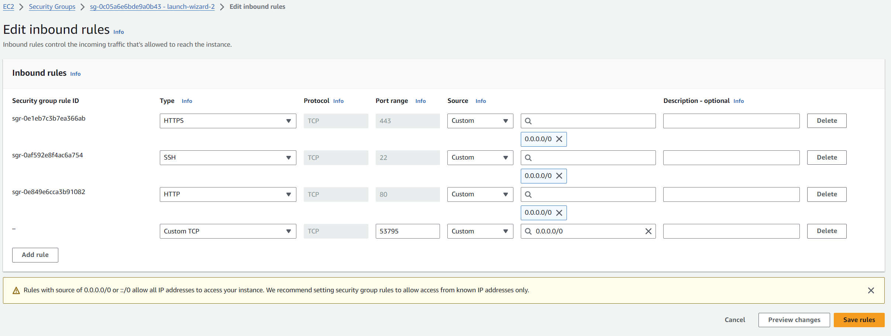
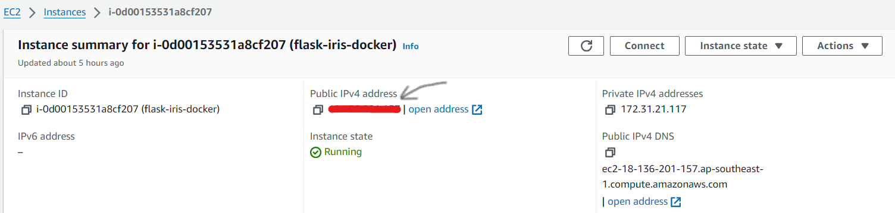

# Deploying Flask-Iris Template on AWS EC2

## Launching EC2 instance

1. Log in to AWS Management Console
2. Search for `EC2` in the search bar and go to EC2 Service Page
3. Click on `Launch Instance` to create an EC2 instance
   - Choose `Amazon Linux` as the operating system
   - For `Amazon Machine Image (AMI)`, pick `Amazon Linux 2 AMI (HVM) - Kernel 5.10, SSD Volume Type`
   - Create a new key pair or selecting existing one
   - For `Network Settings`, check all checkboxes to allow SSH, HTTP and HTTPS traffic
   - Depending on estimated storage size, configure storage. 8 GiB is sufficiently for this prototype
   - Click on `Launch Instance` to get the instance running.
3. After the instance state is updated to `Running`, click on the `Instance ID` link.
4. Scroll down and navigate to the `Secruity` tab
5. Click into the security group listed under `Inbound rules`
6. Click on the `Security group ID` and `Edit inbound rules`
7. Add a new inbound rule to allow all incoming tcp traffic from port `53795`
   

## Connecting to Remote Server

After the instance state is updated to `Running`, click on the `Instance ID` link and then `Connect`

### With EC2 Instance Connect

Under the `EC2 Instance Connect` tab, click the `Connect` button to establish a connection with the remote server

### With SSH

1. For Windows machine, use Git Bash shell
2. Locate the key pair (.pem) file
3. Under the `SSH` client tab, follow the instruction to connect to the remote server
  
## Installing dependencies

Once in, perform a yum update by running

  ```bash

  sudo yum update -y

  ```

Then, run the following commands to install `docker`, `docker-compose` and `git` on the server. Type `y` to permit installation if prompted

  ```bash
  sudo amazon-linux-extras install docker
  sudo curl -L "https://github.com/docker/compose/releases/download/1.29.2/docker-compose-$(uname -s)-$(uname -m)" -o /usr/local/bin/docker-compose
  sudo yum install git -y
  ```

Run the following command to make `docker` and `docker-compose` executable

  ```bash
  sudo chmod 777 /var/run/docker.sock
  sudo chmod 777 /usr/local/bin/docker-compose
  ```

## Start Docker Daemon

Run the following command to start Docker Daemon

  ```bash
  sudo systemctl start docker
  ```

Make sure docker daemon has started successfully by running

  ```bash
  docker run hello-world
  ```

## Clone git repository

Clone the git repo by running

  ```bash
  git clone https://github.com/xili44/iris-flask-docker.git
  ```

## Running Docker container

`cd` into iris-flask-docker

  ```bash
  cd iris-flask-docker
  ```

Give execute permission to `entrypoint.sh` by running

  ```bash
  chmod +x entrypoint.sh
  ```

Create the log file and give write permissions by running

  ```bash
  touch iris-main.log
  chmod 777 iris-main.log
  ```

Build and start the container by running

  ```bash
  docker-compose up --build -d
  ```

The IRIS Management Portal is available at `http://PUBLIC_IPV4_ADDRESS:53795/csp/sys/UtilHome.csp`

Flask REST APIs are available at `http://PUBLIC_IPV4_ADDRESS:53795/flask/*`

`PUBLIC_IPV4_ADDRESS` is avaible in `EC2>Instances>THIS_INSTANCE`


